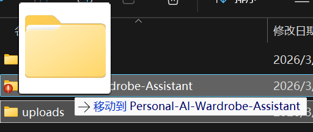
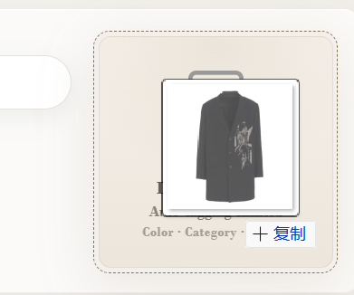
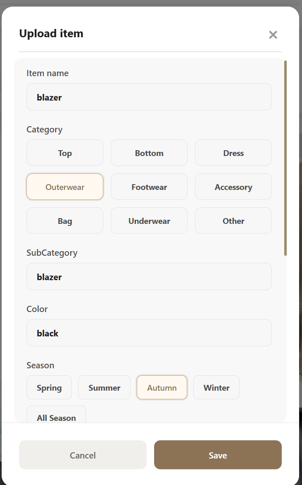
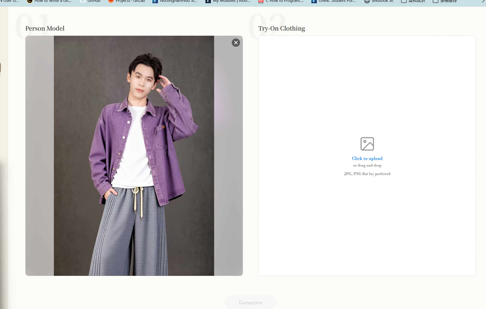
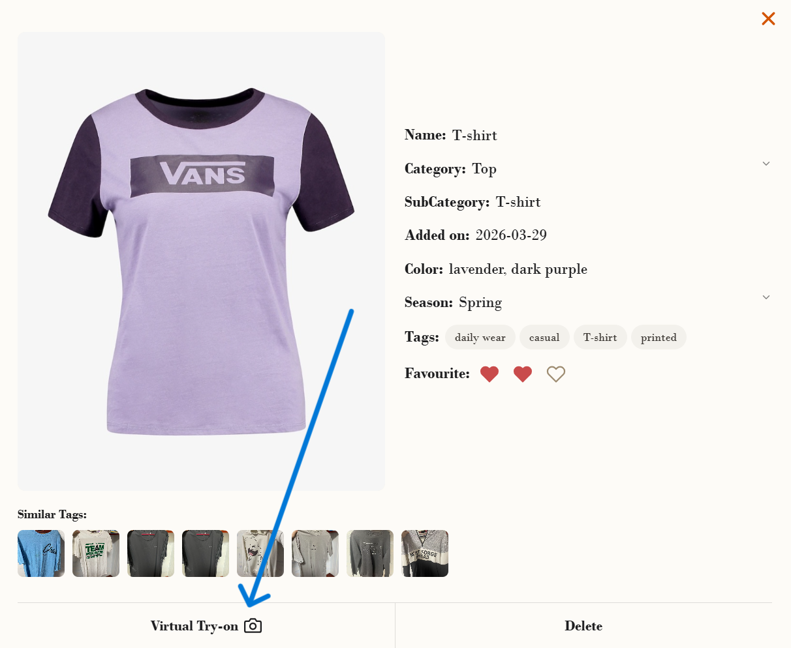
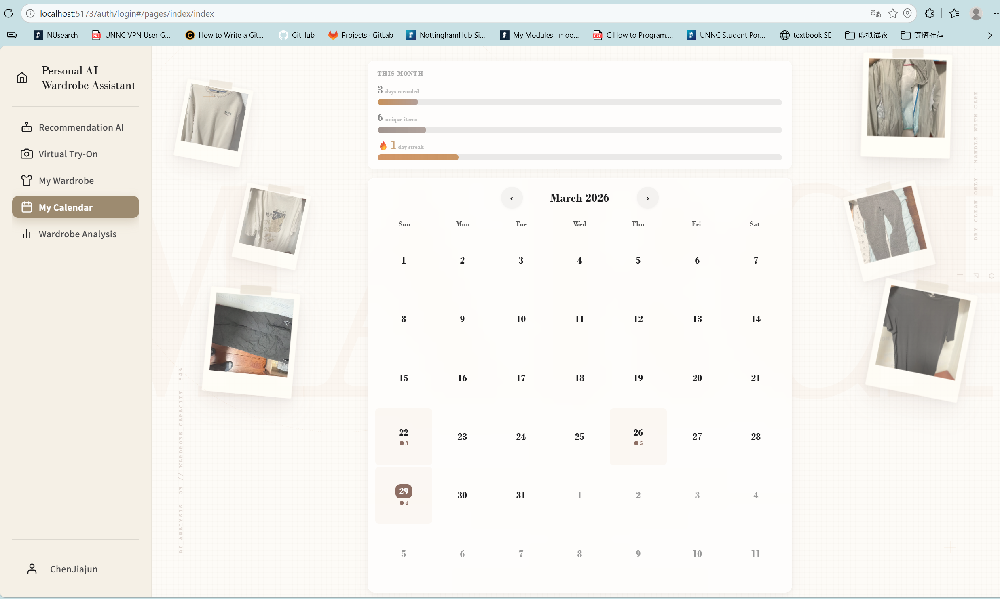

# Personal AI Wardrobe Assistant User Manual

Welcome to Personal AI Wardrobe Assistant! This manual will guide you through the app's core features, including wardrobe management, AI outfit recommendations, virtual try-on, and more. Please follow the steps below.

## First-Time Use Tips

### Browser Security Warning

When opening the app for the first time, your browser may show a warning such as "The connection to this site is not secure." Please choose to **allow location access** to ensure the app works properly.

### Data Migration

To migrate local data to a new device:

1. Find the `uploads` folder in the project root on the original device.
2. Copy the entire folder to the same location on the new device.

## Login and Registration

### Register an Account

1. Click the `Register` button on the home page.
2. Register with a valid **email address**.

### Log In

1. Return to the `Login` page.
2. Log in with your registered email and password.

> ✅ After logging in successfully, all features are available.

## My Wardrobe

### Add a Model

1. Go to the `Model` page.
2. Upload a model photo (recommended: **front-facing, clear, no occlusion**).
3. You can set a preferred photo as the **default model** for faster try-on.

> 📷 Photo requirements: simple background, even lighting, and no occlusion on face/body.

### Add Clothing

1. Go to the `Cloth` page.
2. **Drag and drop** an image into the `Add item` area, or click to select an image file.
3. After automatic analysis, you can **manually add tags** to supplement or correct the description.

> 💡 Example tags: color, style (casual/formal), season (spring/summer or autumn/winter), material, etc.

### Organize Your Wardrobe

- Use `Filter` to screen items by **category** (tops, pants, skirts, etc.).
- Mark items with **preference level (❤)** for personalized sorting and management.

## Recommendation AI

Chat with AI for outfit suggestions. You can specify:

| Condition Type | Examples |
|----------|------|
| Occasion | Date, interview, sports, travel |
| Time | Morning, afternoon, evening |
| Location | Office, outdoors, restaurant |
| Style | Casual, business, street, elegant |
| Purpose | Photoshoot, commute, party |

> 📌 **Wardrobe and Recommendations:** AI outfit recommendations are mainly generated based on items already in your **personal wardrobe**. For better results, upload enough clothing items before asking. If you want suggestions that include items you do not currently own (for example, pieces you plan to buy), please **state this clearly** in your prompt (e.g., "I want to buy..." or "Recommend items I don't have yet"), so the system can give more relevant results.

> 💡 Tip: The more specific your description, the more accurate the recommendation.

## Virtual Try-On

### Method 1: Manual Try-On

In the `Virtual Try-On` page, manually select a model image and a clothing image.

### Method 2: Try On from Wardrobe

1. In `My Wardrobe` → `Cloth`, select a clothing item.
2. Click the `Virtual Try-On` button on the image.

### Method 3: Try On from AI Recommendations

1. In `Recommendation AI`, click `Virtual Try-On` next to the recommended item.
2. If the recommendation is a **full outfit**, click `Full Outfit Try-On` at the bottom to try on the entire set.
3. If you are not satisfied with the recommendation, click `Regenerate Look` in the lower-right corner to generate a new suggestion.

> ✅ Try-on result: the system overlays clothing onto the model to preview the outfit.

## My Calendar

| Add Method | Instructions |
|----------|----------|
| Manual Add | In `My Calendar`, select a date and manually place the outfit for that day. |
| Add from AI Recommendation | In `Recommendation AI`, click `Add to Calendar` next to your preferred outfit to add it to **today's outfit** automatically. |

> 📅 Purpose: record daily outfits for review and planning.

## Wardrobe Analysis

In `Wardrobe Analysis`, the system provides the following analysis dimensions:

| Analysis Dimension | Description |
|----------|------|
| Activity | Frequency of using recommended outfits |
| Favorites | Most frequently worn items |
| Category Analysis | Quantity ratio by clothing category |
| Suggested Additions | Suggested item types to add based on your current wardrobe |

> 💡 Tip: Reviewing analysis reports regularly helps optimize wardrobe structure.

## FAQ

### Q: Why does the browser show an "insecure connection" warning?

A: This is a generic browser warning for local or non-HTTPS environments. Please choose to **allow location access** to use the app normally.

### Q: What should I do if photo analysis fails after upload?

A: Please check whether the photo is front-facing, clear, and not occluded.

### Q: How do I delete or edit added models/clothing items?

A: In the corresponding `Model` or `Cloth` page, hover and click the `Delete` button at the top-right of the image, or click the image to enter the detail page and click the `Delete` button at the bottom-right.

### Q: How can I improve AI recommendation accuracy?

A: To improve accuracy, you can:
- Add more items to your wardrobe.
- Add more accurate tags to items.
- Provide more specific scenario descriptions in the conversation.

### Q: Is data stored locally or in the cloud?

A: In the current version, data is stored on your **local device**. When switching devices, follow the [Data Migration](#data-migration) instructions.

---

You have now learned all core features of Personal AI Wardrobe Assistant. Enjoy using it!