# Personal AI Wardrobe Assistant 用户使用手册

欢迎使用 Personal AI Wardrobe Assistant！本手册将指导您完成应用的核心功能操作，包括衣橱管理、AI穿搭推荐、虚拟试穿等。请按以下步骤使用。

## 首次使用提示

### 浏览器安全警告

首次打开应用时，浏览器可能会提示“您与此网站之间建立的连接不安全”。请选择**允许使用位置信息**，以确保应用功能正常使用。

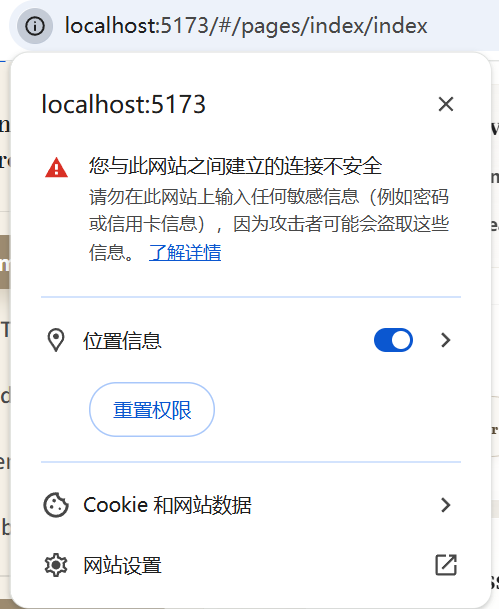

### 数据迁移

如需将本地数据迁移至新设备：

1. 在原设备中找到应用根目录下的 `uploads` 文件夹
2. 将该文件夹完整复制到新设备的相同位置

## 登录与注册

### 注册账户

1. 在首页点击 `Register` 按钮
2. 使用有效的**电子邮箱**注册账户

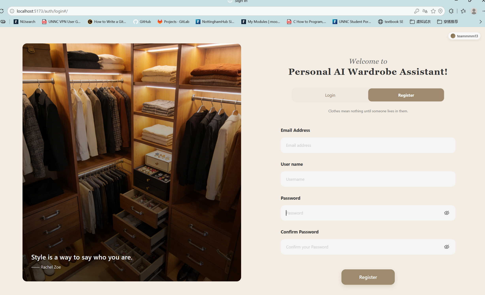

### 登录账户

1. 返回 `Login` 页面
2. 使用已注册的邮箱和密码登录

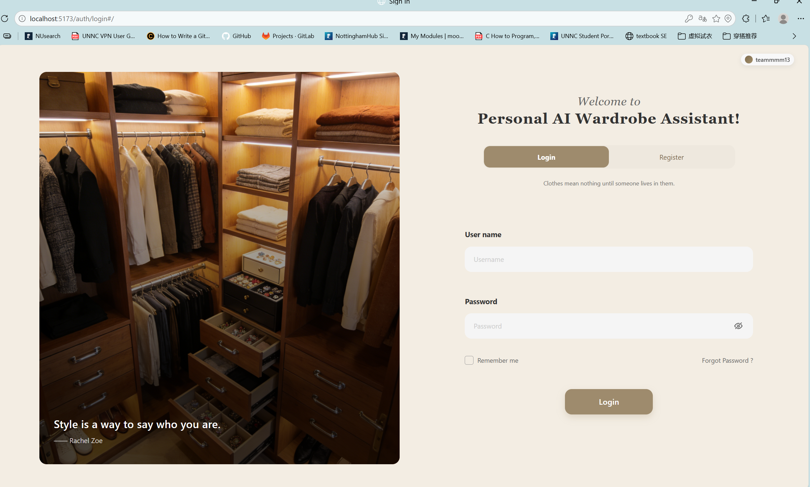

> ✅ 登录成功后即可使用全部功能。

## 个人衣橱（My Wardrobe）

### 添加模特（Model）

1. 进入 `Model` 界面
2. 上传模特照片（建议使用**正面、清晰、无遮挡**的照片）
3. 可将喜欢的照片设为**默认模特**，便于快速试穿

> 📷 照片要求：背景简洁、光线均匀、面部与身体无遮挡。

### 添加衣物（Cloth）

1. 进入 `Cloth` 界面
2. 将图片**拖拽**到 `Add item` 区域，或点击选择图片文件
3. 系统自动分析衣物后，可**手动添加标签（Tag）** 以补充或更正描述

> 💡 标签示例：颜色、风格（休闲/正式）、季节（春夏/秋冬）、材质等。

### 整理衣橱

- 使用 `Filter` 功能按**类型**筛选衣物（如上衣、裤子、裙子等）
- 可为衣物标记**喜好程度（❤）**，方便个性化排序与管理

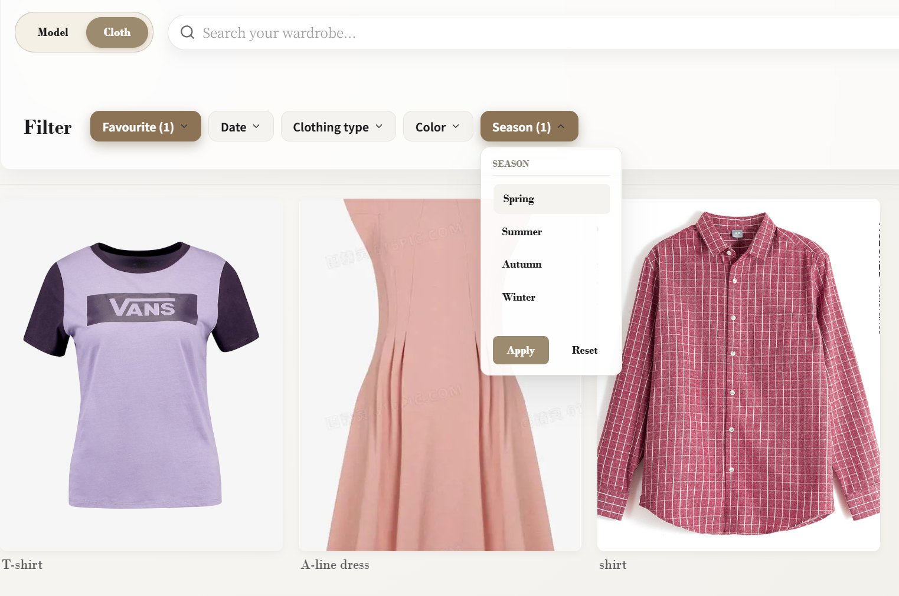

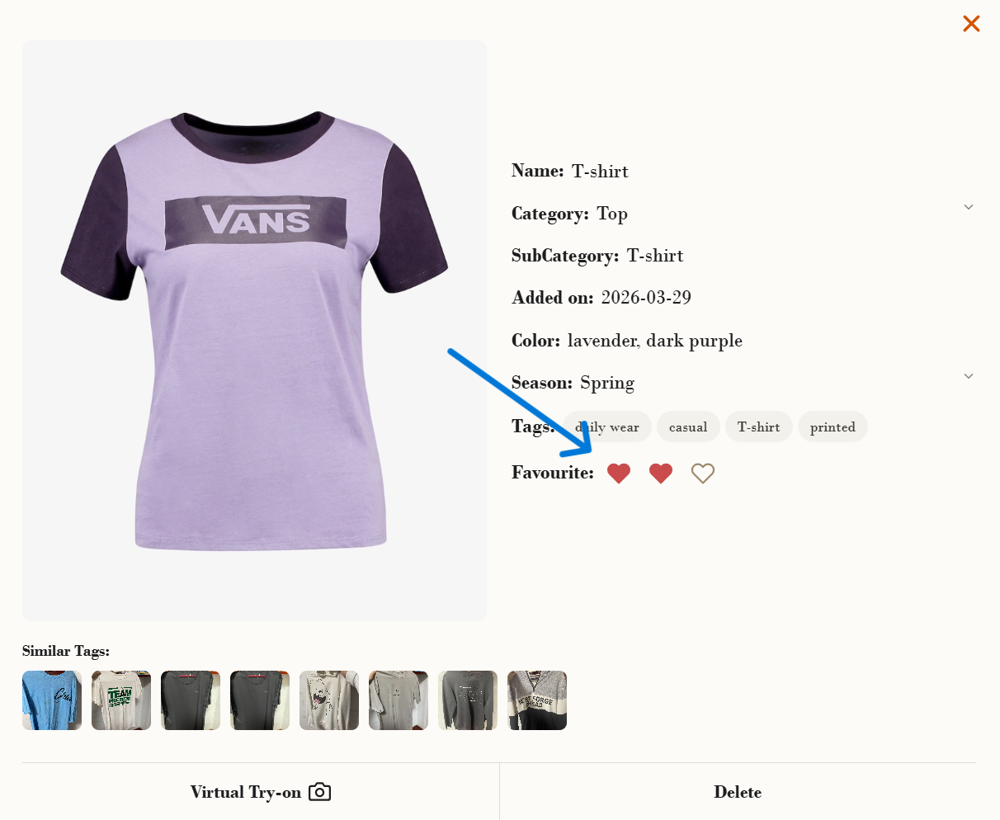

## AI穿搭推荐（Recommendation AI）

与AI对话获取穿搭建议，可指定以下条件：

| 条件类型 | 示例 |
|----------|------|
| 场合 | 约会、面试、运动、旅行 |
| 时间 | 上午、下午、晚上 |
| 地点 | 办公室、户外、餐厅 |
| 风格 | 休闲、商务、街头、优雅 |
| 目的 | 拍照、通勤、派对 |

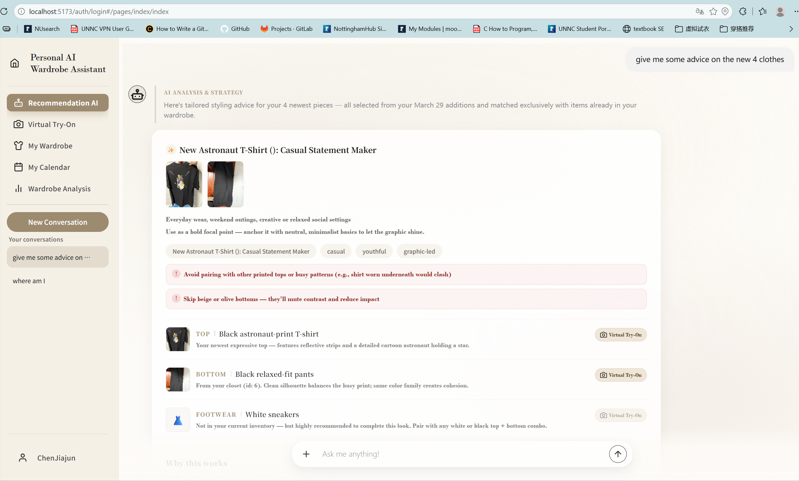

> 💡 提示：描述越具体，AI推荐越精准。

## 虚拟试穿（Virtual Try-On）

### 方式一：手动试穿

在 `Virtual Try-On` 界面**手动选择**模特图片与衣物图片

### 方式二：从衣橱中试穿

1. 在 `My Wardrobe` → `Cloth` 界面选择衣物
2. 点击图片上的 `Virtual Try-On` 按钮

### 方式三：从AI推荐中试穿

1. 在 `Recommendation AI` 中，点击推荐衣物后方的 `Virtual Try-On` 按钮
2. 若推荐的是**穿搭套装**，可点击最下方的 `Full Outfit Try-On` 一键试穿整套搭配
3. 若对推荐结果不满意，可点击右下角 `Regenerate Look` 以重新生成穿搭推荐

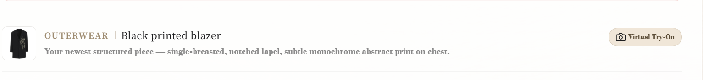

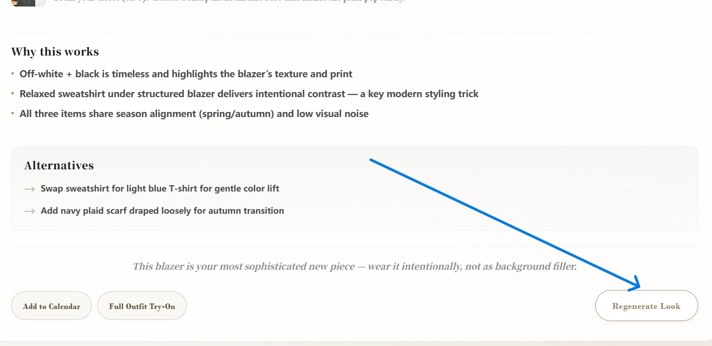

> ✅ 试穿效果：系统会将衣物叠加到模特身上，展示搭配效果。

## 穿搭日历（My Calendar）

| 添加方式 | 操作说明 |
|----------|----------|
| 手动添加 | 在 `My Calendar` 界面选择日期，手动放置该日穿搭 |
| 从AI推荐添加 | 在 `Recommendation AI` 中，点击心仪穿搭组合旁的 `Add to Calendar`，自动添加至**今日穿搭** |

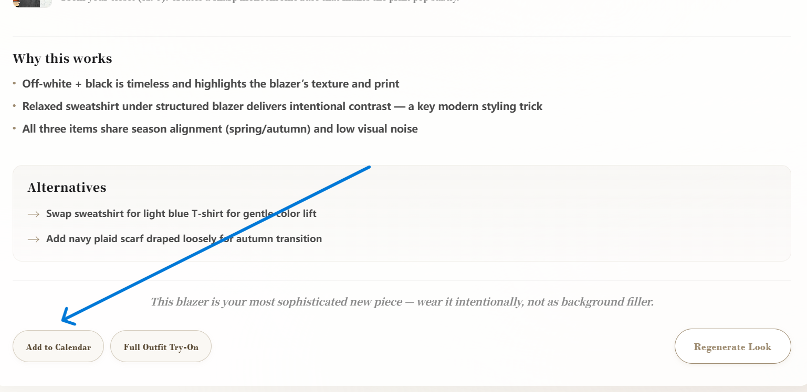

> 📅 用途：记录每日穿搭，便于回顾与规划。

## 衣橱分析（Wardrobe Analysis）

在 `Wardrobe Analysis` 中，系统为您提供以下维度的衣橱分析：

| 分析维度 | 说明 |
|----------|------|
| 活跃度 | 使用推荐穿搭的频率 |
| 喜爱榜 | 被穿次数最多的衣物 |
| 类型分析 | 各类型衣物的数量占比 |
| 补充推荐 | 根据现有衣橱建议补充的衣物类型 |

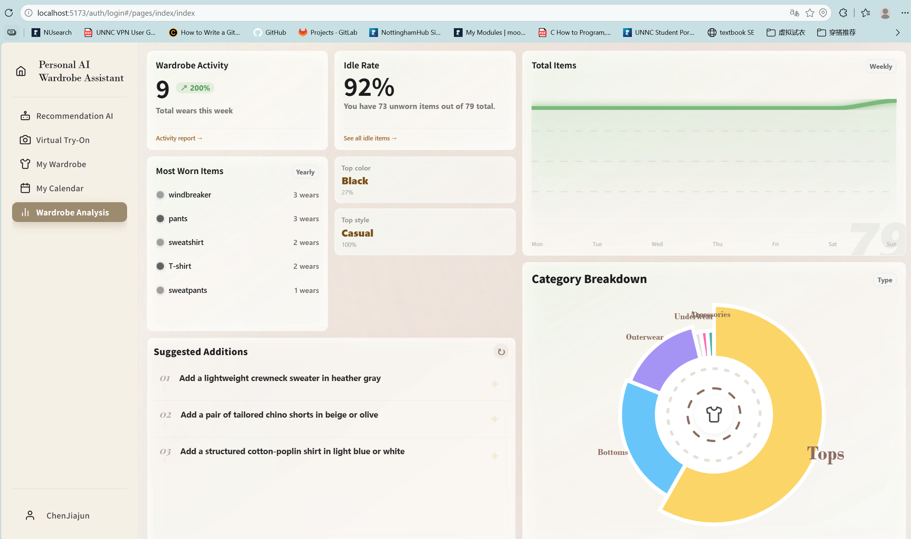

> 💡 提示：定期查看分析报告，有助于优化衣橱结构。

## 常见问题（FAQ）

### 问：为什么浏览器提示“连接不安全”？

答：这是浏览器对本地或非HTTPS环境的通用提示。请选择**允许使用位置信息**即可正常使用。

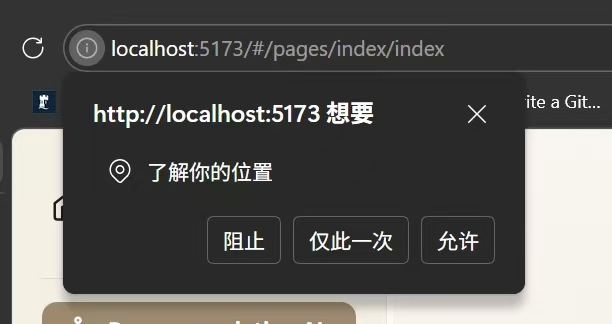

### 问：上传照片后分析失败怎么办？

答：请检查：照片是否正面、清晰、无遮挡

### 问：如何删除或编辑已添加的模特/衣物？

答：在对应的 `Model` 或 `Cloth` 界面，点击图片右上角的 `Delete` 按钮。

### 问：AI推荐不准确如何优化？

答：尝试：
- 补充衣橱中更多衣物
- 为衣物添加更精准的标签
- 在对话中提供更具体的场景描述

### 问：数据是保存在本地还是云端？

答：当前版本数据保存在**本地设备**。更换设备时请按照[数据迁移](#数据迁移)说明操作。

---

至此，您已掌握 Personal AI Wardrobe Assistant 的全部核心功能。祝您使用愉快！