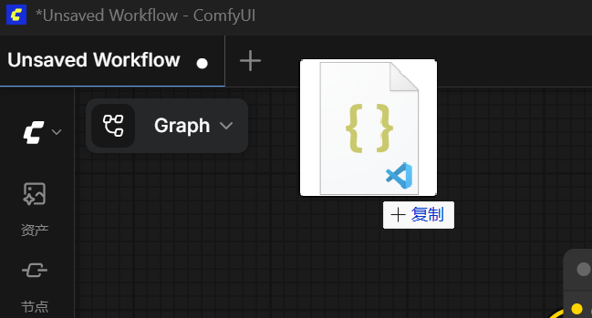
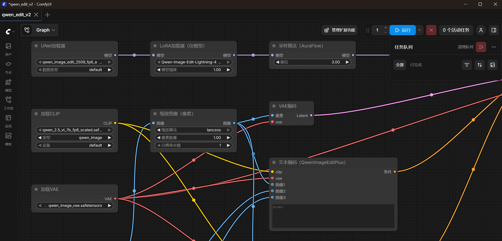
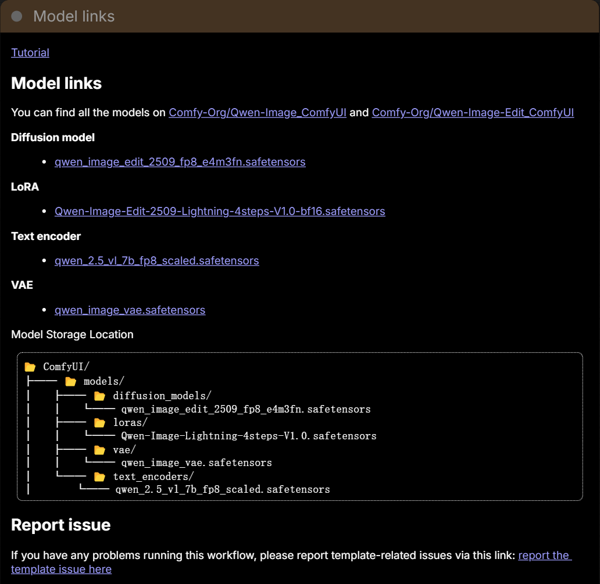

# Personal AI Wardrobe Assistant 用户安装手册

欢迎使用 Personal AI Wardrobe Assistant！本手册将指导您完成项目的下载、环境配置与运行。请按以下步骤操作。

## 推荐配置

为获得最佳性能体验，建议使用以下硬件配置：

### 显卡
NVIDIA GeForce RTX 4090 或更高型号

#### 内存
32 GB 或以上

## 项目下载

```bash
git clone https://github.com/lwowlwowl/Personal-AI-Wardrobe-Assistant.git
cd Personal-AI-Wardrobe-Assistant
```

或直接下载 ZIP 包：点击仓库页面的绿色 Code 按钮，选择 Download ZIP。

## 软件准备

### PostgreSQL

- 下载地址：https://www.postgresql.org/download/
- 安装教程：https://www.postgresql.org/docs/current/tutorial-install.html
- 注意事项：
  - 安装时请记住设置的数据库用户名和密码
  - 请预先在postgreSQL中创建空数据库，并在 `.env` 文件中配置 正确的连接信息
  - 本项目在**首次成功启动后端**时，会根据程定义自动在PostgreSQL中创建所需数据表，**无需单独提供或执行建表SQL脚本**
  - 安装完成后，确保 PostgreSQL 服务处于运行状态

### ComfyUI

- 下载地址：https://www.comfy.org/zh-cn/download
- 安装教程：https://github.com/comfyanonymous/ComfyUI#readme
- 工作流配置：
  1. 打开 ComfyUI
  2. 将项目中的工作流文件 `qwen_edit_v2.json` 拖入 ComfyUI 界面

  ```bash
  # 工作流文件位置
  src\backend\app\resources
  ```

  
  
  

  3. 下载模型：点击左列上侧最下方的【模板】按钮，在【所有模板】的搜索框输入“Qwen Image”；或在搜索框下方【模型筛选】中点击“Qwen-Image”。选择“Qwen Image Edit 2509”，全部下载所需对应模型。

  4. 将模型放在对应的文件夹位置

  ```bash
  # 模型文件夹位置
  ComfyUI\models
  ```

  
  

## 项目运行

### 虚拟环境配置

在项目根目录下创建并激活虚拟环境：

```bash
# 创建虚拟环境
python -m venv venv

# 激活虚拟环境
# Windows:
venv\Scripts\activate
# macOS / Linux:
source venv/bin/activate
```

### 前端运行

1. 进入前端目录：

```bash
cd src/frontend
```

2. 安装依赖：

```bash
npm install
```

3. 构建并启动：

```bash
npm run build:h5
npm run dev:h5
```

4. 浏览器访问 http://localhost:5173，看到登录界面即成功。

### 后端运行

1. 打开新的终端窗口（保持前端服务运行）
2. 进入后端目录：

```bash
cd src/backend
```

3. 配置环境变量：编辑 .env 文件，将数据库用户名和密码替换为 PostgreSQL 中设置的信息

4. 安装依赖：

```bash
pip install -r requirements.txt
```

5. 启动服务：

```bash
python -m uvicorn main:app --reload --port 8000
```

6. 访问 http://localhost:8000/docs 看到 API 文档即成功。

## 验证安装

| 服务 | 地址 | 状态 |
|------|------|------|
| 前端 | http://localhost:5173 | 显示登录界面 |
| 后端 | http://localhost:8000/docs | 显示 API 文档 |

至此，项目已成功下载、安装并启动完成。
